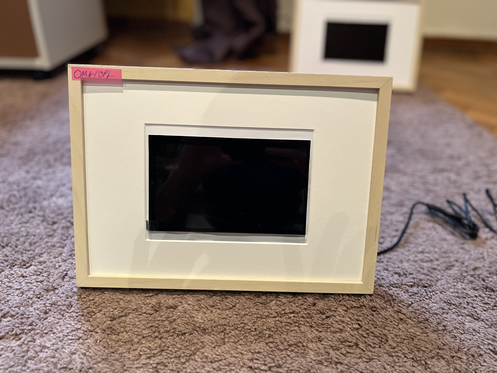

## Magic Frame

This project builds a web server that can store images and share them between users.

The `website` folder contains the code to set up on your web server.  
I used **Apache2**, **PHP**, and **SQLite3**.

The `Raspberrypi` folder contains the code that runs on your Raspberry Pi (the Magic Frame).

---

## Setup

Clone the repo onto your Pi.

Navigate into the setup folder and adapt the username from `kingu` to the name of your Pi.  
Then give the correct permission to the setup script and execute it:

```bash
chmod +x Raspberrypi/setupscript.sh
sudo ./Raspberrypi/setupscript.sh
```

If the location of your repo differs from mine, adjust the path inside the setup file or afterwards in the autostart file.  
After restarting, the script should run automatically.

---

## Update

**ATTENTION:** The script automatically pulls the latest version on every reboot.  
If you do not want this behavior, remove that line from the script.

---

## Display

For easier assembly, I rotated the screen output.  
If you do not want this, remove the rotation section in the setup script.

---

## Build

- **Display:** [7 inch 1024×600 HDMI LCD Display with Touch Screen](https://www.elecrow.com/7-inch-1024-600-hdmi-lcd-display-with-touch-screen.html)
- **Frame:** *Hovsta* from IKEA — unfortunately, I couldn't find a link.
- **Raspberry Pi:** 3B+ (older versions might work too, but this one is recommended by the display manufacturer)

---




  
This plastic piece normally holds a photo in place — I cut it out so it could support the screen. Also I put another layer of paper infront for better estatics.